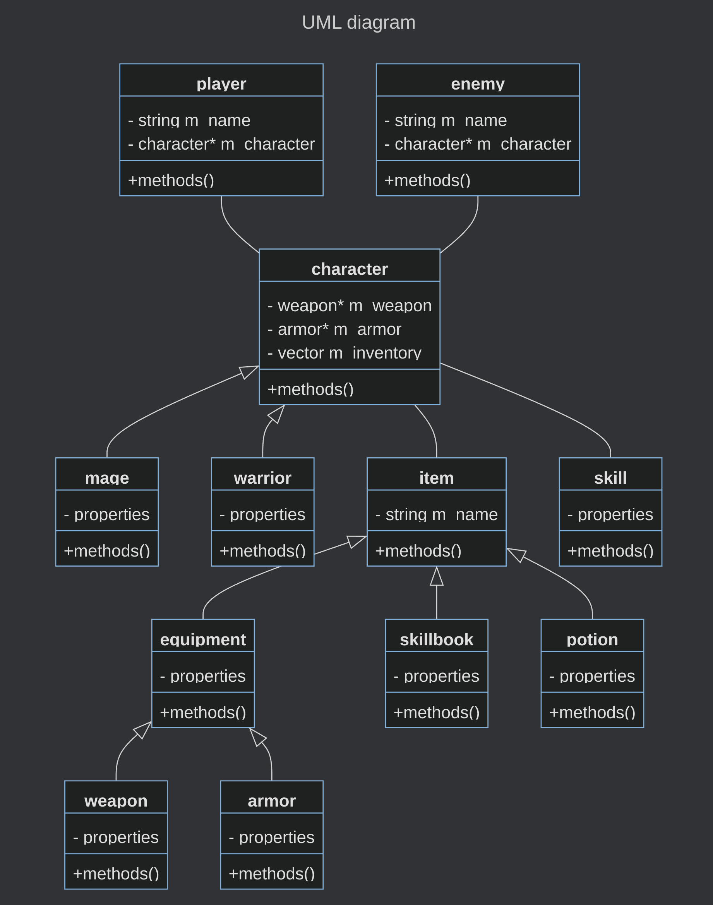

# Adventure

---

## How to run it

You have two possibilities if you want to play this game on your computer:
- download the executable from the `release` here in the `repository`;
- download the whole repository (in `.zip` format) and compile it in your own computer.

After that, you only need to run the executable, and the game should open in a terminal.

Good game!

---

## Overview

Adventure is a simple console based RPG game realised in C++ for a OOP introduction course.

There are a lot of different classes, organized in the following manner:

(the menu class only exists for convenience's sake)

---

## Step by step introduction

### new game

At the very beginning, you are invited to create a new game.
From there, you will have the possibility to create a new character
from one of the two following classes: mage or warrior.

The mage is, of course, magic oriented, and thus, has less health points, melee attack and defense.
Instead, he has a bigger mana pool and a 20% bonus on magic skills.

The warrior, as expected, is oriented toward physical attacks,
so he has more health points, melee attack and defense while his mana is lesser than the mage.
His buff consists of 10% increase on physical skills (skills with no mana cost).

After creating the character, you're ready to go!

---

### game options (main menu)

In game, you have multiple options:
- [start a new battle](#battles)
- [check the inventory](#inventory)
- [rest](#rest) 
- quit (return to the principal menu)
***be careful, your game will be lost*** (there's no saving option)

---

### battles

You will face a random enemy based on your level and equipment.
Its name and equipment will have a different name
according to its characteristics and statistics.

Each turn, you will be able to use a skill or a potion,
and to flee, if you think you will not survive.

***BE CAREFUL: once you're DEAD, it's GAME OVER!***

Once you kill the enemy, you will receive some of its items
and the experience points set at its creation (according to its level and yours).

---

### inventory

In the inventory, you will see all the items you possess
(there is no maximum space, so it can be pretty huge).
You can select an item or return to the main menu.

If you select an item, you will be able to use it, drop it or return.

---

 ### rest

Resting is vital for your survival in this game, because the enemies can be pretty
tough, and ***DEATH IS FATAL*** (just to be sure you read it clearly).

This option will grant you a 10% regeneration in health points and mana freely and
without any cool down.

Just a friendly advice: if you think you'll die in a battle, just flee, rest until
you're fresh, and retry.